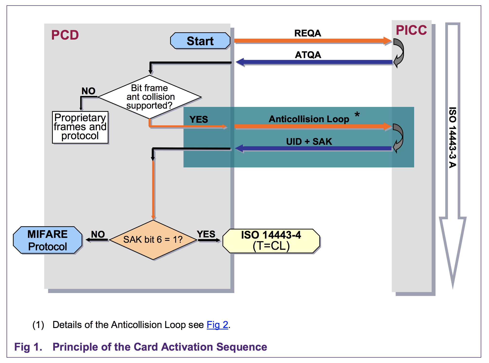
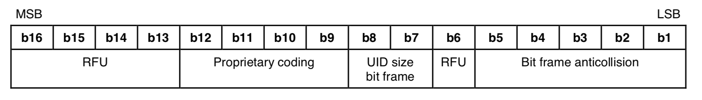
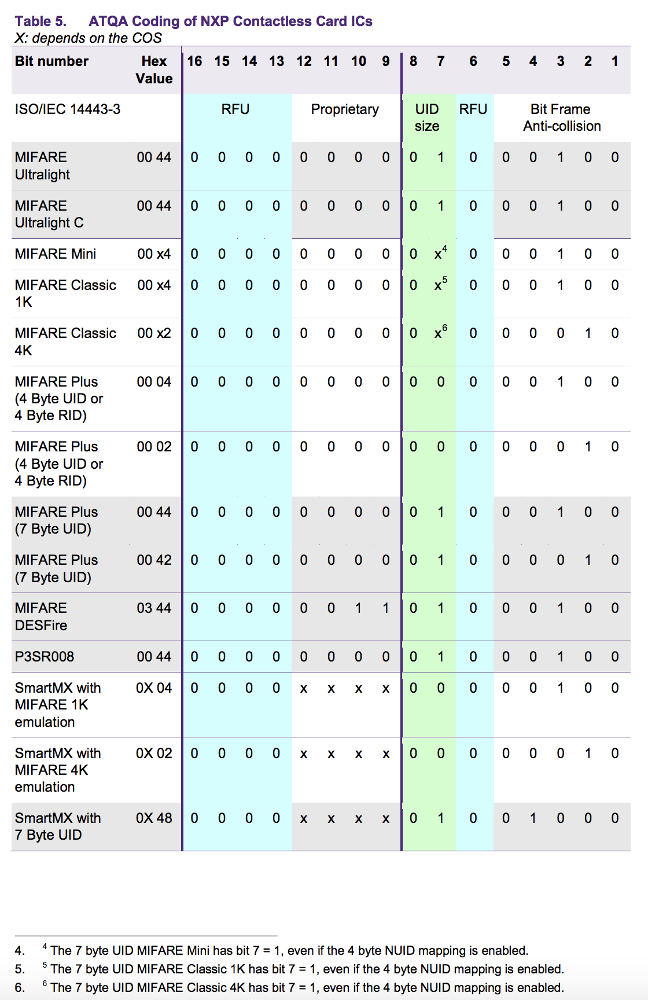
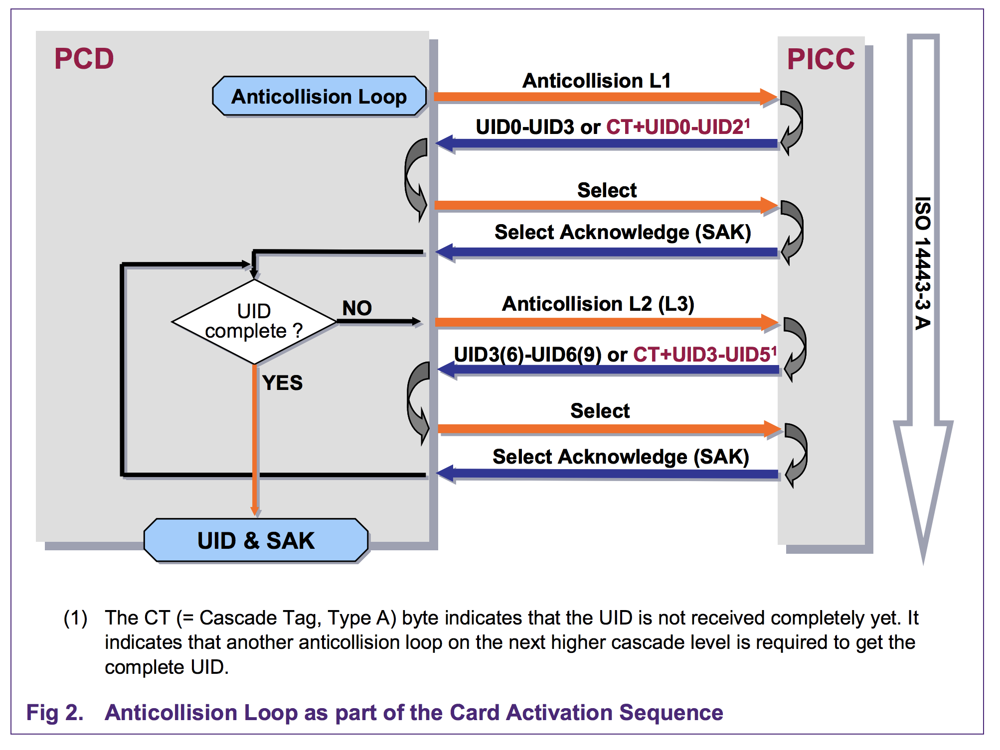

# ISO14443A-106 Card Activation

The activation/selection process for ISO14443A-106 type cards (Mifare Classic,
NTAG20x, etc.) can be seen in the various images below, and is implemented in **`Adafruit_MFRC630`** via the following functions:

- `uint16_t iso14443aRequest(void)`
- `uint8_t  iso14443aSelect(uint8_t *uid, uint8_t *sak)`

## Step One: REQA/ATQA (Request for Card Details)

> This process is implemented via `uint16_t iso14443aRequest(void)`

The first part of the card activation process involves sending the `REQA`
command (REQuest, Type A), which on success will gives us the
two byte `ATQA` (Answer To reQuest, Type A) as a response, and shown below:

Based on the `ATQA` response, we can determine what type of anti-collision
procedure to perform to obtain further information on the card type.

The 16-bit ATQA response has the following format (see ISO-14443-3 for details):

- Bits 1:5 indicate the type of bit frame anticollision
- Bits 7:8 indicate the size of the UID, where:

| B8 | B7 | Size    |
|----|----|---------|
| 0  | 0  | Single  |
| 0  | 1  | Double  |
| 1  | 0  | Triple  |
| 1  | 1  | Rsrvd.  |

In the case of **Mifare** cards, the following values can be used to identify
the type of card you are dealing with
(source: [AN10833](https://www.nxp.com/docs/en/application-note/AN10833.pdf)):

Based on this information, and assuming we have a valid ISO14443-A card, we
can proceed to the selection and anti-collision phase to extract the UID and
SAK values from the card.

> NOTE: The UID size generally varies between 4-7 bytes with commonly used
  ISO14443-A card types.

## Step Two: Selection/Anti-Collision Loop (UID+SAK retrieval)

> This process is implemented via `uint8_t iso14443aSelect(uint8_t *uid, uint8_t *sak)`

The final step before ISO14443-A commands can be send to work with the card's
contents is the **selection** process, which allows you to select a single card
in the near field since multiple cards may be present.

This involves something called the **anti-collision loop**, which is described
in detail in ISO-14443-3 section 6.4.3.1, but a high level overview can be seen
in Fig 4 below.

The anti-collision loop is used to retrieve the variable-length uid, and will
have between one and three iterations, depending on the length of the card's
UID, where every 4 bytes in the uid will require one iteration through the
loop.

> If you require a more detailed overview of the selection procedure, the
  technical details of the selection process are summarised in
  [AN10834](https://www.nxp.com/docs/en/application-note/AN10834.pdf) from NXP,
  which unlike the ISO-14443 standard is freely available.

If the anti-collision loop terminates successfully (whether than took one, two
or three iterations), we can reconstruct the uid from the response data and
we will receive a **`SAK`** (Select Acknowledge) value back describing more
details of the card we have selected.

Some common SAK values are shown below:

## Step Three: Mifare/NTAG/etc. Commands

At this point, the card has been **selected**, and we can proceed to access the
card using higher level protocols that are built on top of ISO14443-A such as
Mifare, NTAG20x, etc..

Each protocol will have it's own authentication and access requirements and
procedures, described the official protocol documentation.

Some key helper functions for working with Mifare tags, for example, are:

- `void mifareLoadKey(uint8_t *key)`
- `bool mifareAuth(uint8_t key_type, uint8_t blocknum, uint8_t *uid)`
- `uint16_t mifareReadBlock(uint8_t blocknum, uint8_t *buf)`
